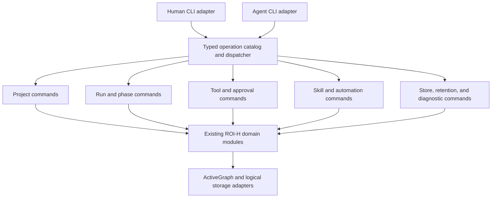

# ROI-H CLI Plan for External AI

**Status:** Proposed implementation plan

**Audience:** Maintainers and implementation agents

**Last updated:** 2026-07-29

**Repository HEAD:** `e01cc4e0f529f0491a78fb0fdd6b84ed4754d88f`

**Product baseline:** `e8a39941f481242d43faf67202f380da2c223bb2`

The repository HEAD only adds the Simplified Technical English reporting rule. The
product capability assessment uses the preceding ActiveGraph storage commit.

This document defines how Codex and other AI systems can use all supported ROI-H
functions without reading the source code, the ActiveGraph SQLite schema, or physical
project paths.

The CLI is the only supported local external-AI interface. Codex and other AI systems
use the installed `roi-h` process.

## 1. Decision

ROI-H will add a small, stable machine interface:

```shell
roi-h agent describe
roi-h agent describe run.start
roi-h agent context
roi-h agent call run.start --input -
```

The interface has three jobs:

1. `describe` tells an AI which operations exist and gives their input and output
   schemas.
2. `context` gives a bounded start state. It includes the selected project and
   environment, health warnings, recent runs, pending approvals, and safe next actions.
3. `call` runs one named operation from a JSON request.

The present human commands will stay available. Both interfaces will call the same
domain command modules. ROI-H will not build a second implementation for AI systems.

## 2. Current Capability Status

The product baseline completes much of the former CLI gap list:

| Area | Available now | Still required |
| --- | --- | --- |
| Projects | List, show, create, use, rename, delete, paths, doctor, export, and import | Plan and apply for destructive delete or replacement |
| Tools | Full input and output schemas, effects, approvals, idempotency, secrets, filesystem roots, and network hosts | One product-wide operation catalog; skill lifecycle is a separate group |
| Runs | Start, invoke, adapt, status, cancel, and reconcile | Discover and list runs; ordered events; bounded trace; wait and reconnect |
| ActiveGraph views | Status includes steps, invocations, approvals, artifacts, phases, budgets, and counters | Stable ordered event and trace operations |
| Approvals | List and approve | Show one approval and reject it through a stable operation |
| Phases | Begin, end, fail, skip, retry, and list | No material domain gap |
| Artifacts and files | Put, list, export, safe run input, and logical run file listing | Artifact show or bounded preview |
| Automations | Ship, list, dry-run, and run by version | Show, verify, and compare versions |
| Secrets | List, set, and delete; macOS projects use Keychain; project files contain metadata only | Standard-input or hidden input; status; native secure providers for each supported platform |
| Store | Status, quick or full check, backup, and staged restore | Common plan and apply for restore |
| Portability | Definition or full `.roih` project export and safe verify or import | Plan and apply when import replaces state |
| Cleanup | Retention plan, show, and apply with stale-plan rejection | Use the same plan contract for other destructive operations |
| Diagnostics | Redacted, versioned `show` and `tail` records | Request correlation, bounded filters, and support bundle |
| Skills | Define a project-local tool; Python code can promote it to user-shared storage | List, show, validate, promote, and delete commands |

These modules are useful implementation foundations. The new plan must use them. It must
not replace them.

## 3. Remaining Problem

The present CLI is not yet a complete external-AI interface:

- An AI must parse `--help` text to discover most commands.
- Tool schemas exist, but project, run, automation, artifact, skill, approval, and store
  operation schemas do not exist.
- A caller cannot list runs, read ordered events, or get a complete run trace from the
  CLI.
- Success results have different shapes.
- command-line usage errors are human `argparse` text, while operation errors have a
  different JSON shape.
- Errors do not have stable codes, retry rules, or state-change information.
- Complex JSON is passed in command arguments. This causes shell quoting and command
  length problems.
- External retries do not have a caller-supplied idempotency key at the CLI seam.
- Most destructive commands do not use the safe plan and apply model that retention
  already uses.
- `secret set NAME VALUE` puts a secret in the process argument list and often in shell
  history.
- Project skill promotion exists in Python, but the recommended `roi-h rpa promote`
  command does not exist.
- Automation inspection is limited to a list. There is no stable show, verify, or compare
  command.
- `roi-h rpa run` runs an automation, while run input and run files use other noun
  positions. Compatibility rewriting hides this problem but does not remove it.

## 4. Definition of Full Product Access

An external AI has full supported access when it can complete these tasks through the
published interface:

1. Inspect the installed version, health, capabilities, and selected context.
2. Create, select, inspect, export, and import a project.
3. Select and inspect a development or production environment.
4. Discover tools and their schemas, permissions, effects, secrets, and retry rules.
5. Start a run, add inputs, invoke tools, control phases, and inspect status.
6. List old runs and read ordered events, steps, approvals, artifacts, and a bounded
   trace.
7. Approve or reject a pending operation.
8. Reconcile an unknown outcome without repeating an unsafe effect.
9. Define, validate, inspect, promote, and remove a user-owned skill.
10. Ship, inspect, verify, compare, and run an automation.
11. Add, inspect, export, and remove artifacts through logical paths.
12. Set and delete secrets without putting values in command arguments or output.
13. Check, back up, and restore a store through guarded operations.
14. Plan, inspect, and apply retention.
15. Read redacted diagnostics and create a support bundle.
16. Retry after a lost response without making the same external effect two times.
17. Disconnect from long work, reconnect, read new events, wait, and cancel when the
    operation permits cancellation.

Raw SQL, raw ActiveGraph graph operations, and unrestricted physical filesystem access
are not product functions. They are not part of full access.

## 5. Module Design

ROI-H will use one typed operation catalog and small domain command modules.



The catalog is a routing and description module. It must not become a universal manager.
Business rules stay local to the project, run, tool, automation, store, secret, and
retention modules.

Each operation descriptor has:

- a stable operation ID, such as `run.start`;
- a short description;
- JSON Schema 2020-12 input and output schemas;
- its effect class: `read`, `write`, or `destructive`;
- its idempotency rule: `not_applicable`, `supported`, or `required`;
- its approval or plan requirement;
- its project, environment, run, filesystem, network, and secret needs;
- its pagination support;
- its expected time limit; and
- its execution mode: `sync` or `task`.

The dispatcher has a narrow interface:

```python
describe(operation_id: str | None) -> OperationManifest
execute(request: CommandRequest) -> CommandResult
```

The dispatcher validates and routes. It does not own a second copy of domain behavior.

## 6. Machine Contract

### 6.1 Request

`roi-h agent call` accepts JSON from standard input or a file:

```shell
roi-h agent call run.start --input -
roi-h agent call run.start --input request.json
```

Example request:

```json
{
  "schema_version": "1.0",
  "request_id": "req_01J...",
  "idempotency_key": "customer-import-2026-07-29",
  "context": {
    "project": "acme",
    "environment": "dev"
  },
  "arguments": {
    "goal": "Download and validate the monthly report"
  }
}
```

`request_id` identifies one call. `idempotency_key` identifies one intended effect.
ROI-H creates a request ID when the caller does not supply one.

The agent interface is always noninteractive. Missing data or approval returns a
structured error. It never opens a prompt, browser, pager, or editor without an explicit
operation.

### 6.2 Success

```json
{
  "schema_version": "1.0",
  "operation": "run.start",
  "request_id": "req_01J...",
  "ok": true,
  "changed": true,
  "context": {
    "project": "acme",
    "environment": "dev",
    "run_id": "run_01J..."
  },
  "result": {},
  "warnings": [],
  "next_actions": []
}
```

### 6.3 Failure

```json
{
  "schema_version": "1.0",
  "operation": "run.start",
  "request_id": "req_01J...",
  "ok": false,
  "changed": false,
  "error": {
    "code": "project.not_found",
    "category": "not_found",
    "message": "The selected project does not exist.",
    "retryable": false,
    "retry_after_ms": null,
    "details": {
      "project": "acme"
    },
    "remediation": [
      {
        "operation": "project.list",
        "reason": "Select an existing project."
      }
    ]
  }
}
```

Agents use the error code and fields. They must not parse the English message.

### 6.4 Output and exit status

- Standard output contains only one JSON result in normal machine mode.
- Progress, logs, and human diagnostics go to standard error.
- Optional long operations use `--output jsonl`. Each line is one typed JSON event. The
  first event states the contract version. The last event is the final result.
- Exit `0` means success or a safe no-change result.
- Exit `1` means an operation or domain failure.
- Exit `2` means an invalid command, request, or schema.
- Exit `130` means the caller interrupted the process.

Detailed failure classes stay in the JSON error. ROI-H must not create many exit codes
that an AI has to map.

### 6.5 Compatibility

- The contract version has a major and minor number.
- A minor version can add optional fields and operations.
- A major version is required for a breaking field or meaning change.
- Callers ignore unknown fields in a supported major version.
- Operation IDs are stable after release.
- Schemas include the JSON Schema 2020-12 dialect.

## 7. Operation Catalog

The first complete catalog contains these groups:

| Group | Required operation IDs |
| --- | --- |
| System | `system.version`, `system.describe`, `system.context`, `system.doctor` |
| Task | `task.list`, `task.show`, `task.events`, `task.wait`, `task.cancel` |
| Project | `project.list`, `project.show`, `project.create`, `project.use`, `project.paths`, `project.doctor`, `project.export`, `project.import.verify`, `project.import`, `project.rename`, `project.delete.plan`, `project.delete.apply` |
| Environment | `environment.show`, `environment.set`, `environment.doctor` |
| Store | `store.status`, `store.check`, `store.backup`, `store.restore.plan`, `store.restore.apply` |
| Tool | `tool.list`, `tool.show`, `tool.invoke` |
| Run | `run.start`, `run.list`, `run.show`, `run.status`, `run.events`, `run.trace`, `run.cancel`, `run.reconcile`, `run.input.add`, `run.files` |
| Phase | `phase.list`, `phase.begin`, `phase.end`, `phase.fail`, `phase.skip`, `phase.retry` |
| Approval | `approval.list`, `approval.show`, `approval.approve`, `approval.reject` |
| Artifact | `artifact.list`, `artifact.show`, `artifact.put`, `artifact.export` |
| Skill | `skill.list`, `skill.show`, `skill.validate`, `skill.define`, `skill.promote`, `skill.delete.plan`, `skill.delete.apply` |
| Automation | `automation.list`, `automation.show`, `automation.verify`, `automation.compare`, `automation.ship`, `automation.run` |
| Secret | `secret.list`, `secret.status`, `secret.set`, `secret.delete` |
| Retention | `retention.plan`, `retention.show`, `retention.apply` |
| Diagnostics | `diagnostic.list`, `diagnostic.tail`, `support_bundle.create` |

The operation catalog describes all these groups. An AI does not need to know the human
command layout.

### 7.1 Confirmed missing human commands

These commands are required. They are not optional examples.

```shell
# Find and follow existing runs.
roi-h rpa runs list
roi-h rpa runs show RUN_ID
roi-h rpa runs wait RUN_ID --timeout 60
roi-h rpa runs cancel RUN_ID
roi-h rpa events list --run-id RUN_ID
roi-h rpa events follow --run-id RUN_ID --after EVENT_ID
roi-h rpa trace show --run-id RUN_ID

# Manage project and user-shared skills.
roi-h rpa skill list
roi-h rpa skill show NAME
roi-h rpa skill validate NAME
roi-h rpa skill promote NAME
roi-h rpa skill delete plan NAME
roi-h rpa skill delete apply PLAN_ID

# Inspect immutable automations.
roi-h rpa automation list
roi-h rpa automation show NAME --version VERSION
roi-h rpa automation verify NAME --version VERSION
roi-h rpa automation compare NAME VERSION_A VERSION_B

# Supply secrets without a value in argv.
roi-h rpa secret status NAME
roi-h rpa secret set NAME --value-stdin
```

The current `roi-h rpa status`, `cancel`, `automations`, and project tool-definition
commands stay as compatibility adapters for one documented release. The new command
groups call the same operation handlers. They must not copy their implementation.

The first skill implementation must also fix the false recommendation in
`harness/custom.py`. A promotion recommendation must name a command that the parser
actually provides.

### 7.2 Confirmed existing commands

Do not reimplement these operations. Register and adapt the existing modules:

```shell
roi-h rpa project paths
roi-h rpa project doctor
roi-h rpa project export NAME --output NAME.roih
roi-h rpa project import NAME.roih

roi-h rpa store status
roi-h rpa store check
roi-h rpa store backup --output backup.roih
roi-h rpa store restore backup.roih

roi-h rpa input add SOURCE --as NAME --run-id RUN_ID
roi-h rpa files --run-id RUN_ID
roi-h rpa artifact export ARTIFACT_ID --output FILE

roi-h rpa gc plan
roi-h rpa gc show PLAN_ID
roi-h rpa gc apply PLAN_ID
```

The current parser accepts `roi-h rpa run input add` and `roi-h rpa run files` through
compatibility rewriting. `roi-h rpa input add` and `roi-h rpa files` are the actual
parser commands. The future top-level `roi-h run` group will remove this ambiguity.

## 8. Run Discovery, Durable Tasks, and Bounded Results

The existing observer projection already has read-only run list and run detail functions.
The CLI must put stable schemas and pagination in front of this implementation.

All lists that can grow without a small fixed limit support:

```json
{
  "limit": 50,
  "cursor": null,
  "filter": {},
  "sort": [{"field": "updated_at", "direction": "desc"}]
}
```

They return:

```json
{
  "items": [],
  "next_cursor": null,
  "has_more": false,
  "snapshot": "opaque-watermark"
}
```

Cursors are opaque. Order is stable. The snapshot value prevents page drift during a
long read. Agent mode does not read every page automatically because that can fill the
AI context.

`run.events` returns canonical ordered ActiveGraph events through the read-only projection
adapter. `run.trace` returns a bounded product view that joins phases, invocations,
approvals, reconciliation, and artifacts. Neither operation exposes SQL rows or an
ActiveGraph internal schema.

Long operations must not depend on one connected process. An operation with execution
mode `task` first returns a task ID. The caller can then use `task.show`, `task.events`,
`task.wait`, and `task.cancel`.

A task has one of these states:

```text
queued
working
input_required
approval_required
succeeded
failed
cancelled
```

Each task event has an opaque event ID, stable sequence, timestamp, type, task ID, request
ID, and typed data. `task.events` accepts an `after` event ID. This lets an AI reconnect
without reading the full event history. A run is still the durable RPA domain record. A
task is only the execution record for a long CLI operation.

## 9. Safe Writes

### 9.1 Idempotency

Each write operation states its retry rule in `describe`.

For a repeated idempotency key:

- the same operation and same normalized arguments return the first result;
- changed arguments return `request.idempotency_conflict`;
- an in-progress first call returns its known state and a safe next action; and
- an unknown external effect routes to reconciliation. It does not run the effect again.

The domain module owns the durable record for the effect. Project and run effects use
ActiveGraph. A home-level effect gets a small, versioned operation record only when no
project store can own it. The catalog must not become another event store.

### 9.2 Plan and apply

Retention already has the correct pattern. ROI-H will extend it to project deletion,
project replacement during import, store restore, and skill deletion.

A plan contains:

- an opaque plan ID;
- the target operation and normalized arguments;
- a clear effect list;
- blockers and required approvals;
- a digest of the relevant current state;
- an expiry time; and
- the exact apply operation.

Apply checks the plan digest and expiry before any change. Changed state returns a stable
conflict error. Apply does not accept an unreviewed caller list of files.

## 10. Secrets

The public secret input becomes:

```shell
printf '%s' "$VALUE" | roi-h rpa secret set NAME --value-stdin
roi-h rpa secret set NAME
```

The second form uses a hidden terminal prompt in human mode. Agent mode requires standard
input or an approved secret-provider reference.

ROI-H must never put a secret value in:

- process arguments;
- command output;
- diagnostic or progress records;
- plans;
- ActiveGraph events;
- automation packages; or
- project JSON files.

Operation schemas mark secret fields. Shared result and diagnostic code uses these marks
for redaction.

## 11. Human CLI Layout

The machine operation IDs are the stable interface. The human command layout can improve
without breaking that interface.

For the first implementation, keep present commands as adapters. Add missing commands
without a large parser rewrite. Mark the confusing compatibility forms as deprecated.

Before version 1.0, move toward these top-level nouns:

```text
roi-h project
roi-h environment
roi-h store
roi-h tool
roi-h run
roi-h phase
roi-h approval
roi-h artifact
roi-h skill
roi-h automation
roi-h secret
roi-h retention
roi-h diagnostics
roi-h agent
```

`roi-h rpa run` must not continue to mean “run an automation” while `roi-h run` means a
run record. The final human name for that action is `roi-h automation run`.

Keep old forms as compatibility adapters for one documented release. Print deprecation
messages only to standard error. Do not keep duplicate command trees after the
compatibility period.

## 12. Implementation Plan

The paste-ready implementation prompt is
[`handoffs/external-ai-cli-implementation-handoff.md`](handoffs/external-ai-cli-implementation-handoff.md).

### Phase 0: Freeze the contract

Deliver:

- typed request, result, error, manifest, page, and progress-event models;
- operation ID and error-code registries;
- effect, idempotency, approval, and plan classifications; and
- checked-in JSON Schema fixtures for contract version 1.0.

Acceptance:

- each registered operation has input and output schemas;
- duplicate operation IDs fail startup;
- secret fields and effect classes are mandatory; and
- the existing storage error codes map to the common error model.

### Phase 1: Add the catalog and machine adapter

Deliver:

- a thin catalog and dispatcher;
- small command modules grouped by domain;
- `roi-h agent describe`;
- `roi-h agent call --input FILE|-`;
- common JSON success and error output;
- clean standard output and standard error behavior; and
- JSON usage errors instead of direct `argparse` exits in agent mode.

Acceptance:

- an agent can discover and call a read operation without parsing help text;
- every result validates against its declared schema;
- no prompt, color, spinner, or pager appears in agent mode; and
- present human commands still work through compatibility tests.

### Phase 2: Add context and complete read access

Deliver:

- `roi-h agent context`;
- run list, show, events, and trace operations;
- tool show;
- approval show;
- artifact show;
- automation show, verify, and compare;
- skill list, show, and validate; and
- cursor, filter, limit, sort, and snapshot support.

Acceptance:

- an agent with no run ID can find the correct run;
- an agent can explain a run from ordered product records;
- no read response needs raw SQLite or physical project paths; and
- all unbounded lists have bounded defaults.

### Phase 3: Make writes and long operations safe

Deliver:

- caller-supplied idempotency keys;
- replay and parameter-conflict behavior;
- stable request correlation;
- approval reject;
- safe unknown-outcome responses; and
- plan and apply for every destructive operation in Section 9;
- task show, events, wait, and cancel; and
- event resume from an opaque last event ID.

Acceptance:

- a lost response and retry does not repeat an external effect;
- changed arguments with the same key fail before execution;
- stale plans fail before a change; and
- each failure states if state changed; and
- an agent can disconnect and reconnect to long work.

### Phase 4: Complete product workflows

Deliver:

- safe secret input;
- skill define, promote, and delete operations;
- automation inspect, verify, compare, ship, and run operations;
- support bundle creation;
- project import replacement plans; and
- human command aliases for all stable operation IDs.

Acceptance:

- the 17 workflows in Section 4 work through only the published CLI;
- project and global skills stay in user-owned storage;
- secrets do not appear in arguments, output, logs, plans, or packages; and
- automation packages remain immutable and digest verified.

### Phase 6: Qualify the external-AI interface

Deliver:

- end-to-end agent fixtures from an empty data home;
- contract compatibility tests;
- interruption and retry tests;
- secret and redaction tests;
- bounded-output tests;
- a short operator guide for Codex, Claude, Gemini, and generic shell agents.

Acceptance:

- a test agent completes every workflow in Section 4 with no source access;
- all output validates against contract version 1.0;
- the package does not contain customer or user-owned data;
- macOS, Windows, and Linux tests use Python 3.12 only; and
- the release gate tests the installed wheel, not only the source checkout.

## 13. Suggested Commit Order

Keep commits small and in dependency order:

1. Add contract models and schema fixtures.
2. Add the operation catalog and read-only dispatcher.
3. Add the agent `describe` and `call` commands.
4. Add common output and error handling.
5. Add run discovery, event, and trace projections.
6. Add pagination and bounded context.
7. Add external idempotency and retry tests.
8. Extend plan and apply to destructive operations.
9. Add durable tasks, wait, event resume, and cancel.
10. Fix secret input and shared redaction.
11. Add skill and automation lifecycle commands.
12. Add the context command and full CLI journey tests.
13. Remove expired compatibility command forms before version 1.0.

Each commit must keep existing storage tests green. Do not combine the parser, storage,
and destructive-plan changes in one commit.

## 14. Research Basis

This plan uses these primary references:

- [Python Packaging User Guide: creating command-line tools](https://packaging.python.org/en/latest/guides/creating-command-line-tools/)
  for the installed Python command model.
- [POSIX utility syntax](https://pubs.opengroup.org/onlinepubs/9699919799/basedefs/V1_chap12.html)
  for predictable arguments and diagnostics.
- [AWS CLI JSON input skeletons](https://docs.aws.amazon.com/cli/latest/userguide/cli-usage-skeleton.html)
  for file-based structured input.
- [AWS CLI pagination](https://docs.aws.amazon.com/cli/latest/userguide/cli-usage-pagination.html)
  for bounded list results and continuation tokens.
- [Terraform machine-readable output](https://developer.hashicorp.com/terraform/internals/machine-readable-ui)
  for versioned typed progress records.
- [Terraform plan](https://developer.hashicorp.com/terraform/cli/commands/plan) and
  [kubectl apply](https://kubernetes.io/docs/reference/kubectl/generated/kubectl_apply/)
  for reviewable plans and dry-run behavior.
- [Stripe idempotent requests](https://docs.stripe.com/api/idempotent_requests)
  for safe retry and parameter-conflict behavior.
- [Docker password input](https://docs.docker.com/reference/cli/docker/login/)
  for secret input through standard input.
- [JSON Schema 2020-12](https://json-schema.org/draft/2020-12) for operation contracts.

The detailed research note is
[`research/external-ai-cli-primary-research.md`](research/external-ai-cli-primary-research.md).

## 15. Explicit Exclusions

Do not:

- expose raw ActiveGraph SQLite;
- mirror generic graph operations in the ROI-H CLI;
- let an AI use unrestricted physical paths;
- put secrets in command arguments;
- auto-read all result pages;
- auto-approve production effects;
- use English error text as a program contract;
- turn the operation catalog into a universal manager or event store; or
- add a second external-AI transport beside the installed CLI.
